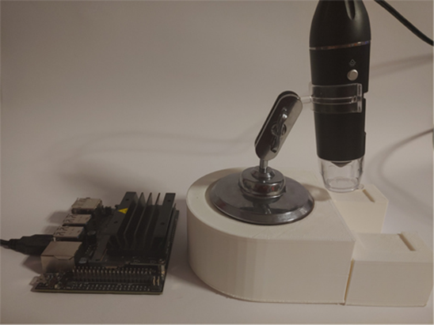
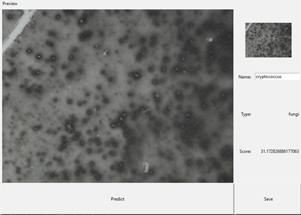

# Neural network for recognation of microorganisms from samples

###### Introduction
   Various types of microorganisms create different patterns on slides. Pattern is determined by many factors. The continuous development of technology allows to introduce of new, more efficient and faster methods of analyzing microorganism samples. Properly trained convolutional neural network can help recognize microorganisms from smears and cytological samples.

###### NN Models (custom and mobilenetV3 - transfer learning)
Models can be downloaded at:
https://drive.google.com/file/d/1MQBA2owkE5fWtWGt3kYr-ERzpr8nT_W8/view?usp=sharing

###### Device
  Neural Network was written in python with tensorflow back-end and keras front-end. The Nvidia Jetson was used to make a device for microorganism sample recognition. The photo of device was shown on figure 1.
  
  

Fig. 1. Photo of device

The device consists of:
* Nvidia Jetson; 
* Microscope;
* 3d printed base for slides;

###### Device
  Input image size for neural network is 128x96 px, then was used a rescaling layer for optymalzation. Convolution include a 3 different layers with mas pooling, the are concentate and flatten for first dense player with 512 neurons. The next step are 2 dense layers with 128 and 32 neurons. Strucutre of neural network was shown in jupyter notebook - custom_model.ipny. For transfer learning it was used mobilenetV3 - jupyter notebook transfer_learning.ipny.
  

###### Training
  The neural network was trained on small sets of 7 different microorganism samples, every class contains about 20 base images, to increase the number or training data images was rotated, zoomed,  etc. Figure 2 shows a sample photos of microorganism.

Fig 2. Example photos of slides

###### User interface
UI allows users to predict type and name of microorganism from samples and also save photos of it for further neural network training or creating new classes. Figure 3 shows UI of application.

Fig. 3. UI

###### Demonstration

